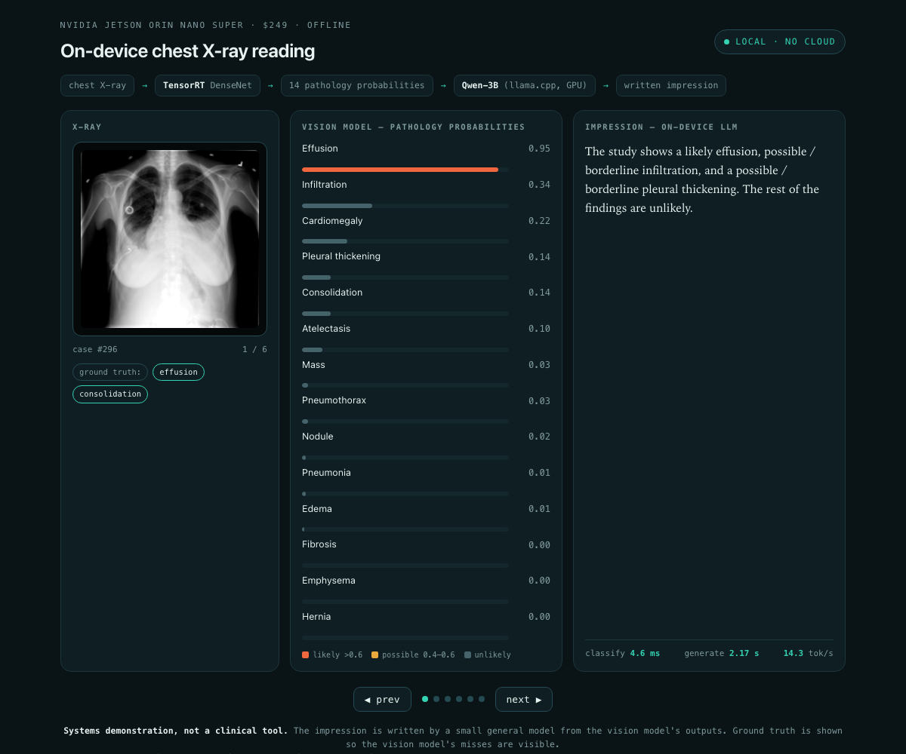

# Demos

Three ways to *see* the multi-clinician panel run: several clinicians hit one $249
Jetson at once, each asking a different question (a different model) that can't be
batched together — so they run concurrently, live, with no cloud.

## `demo_panel_trt.py` — TensorRT-powered (the one to show)

Concurrent TensorRT engines in one process. 4 clinicians, **~398 img/s aggregate**
(5× the PyTorch demo), GPU 97%, 16 W, no memory wall.

```bash
~/xray-venv/bin/python demo_panel_trt.py --seconds 25
```
`--record frames.json` captures the live dashboard frame-by-frame (used to build the
browser replay).

## `demo_panel.py` — PyTorch

The same panel on PyTorch (4 clinicians, different-dataset DenseNets + ResNet-50):
~75 img/s aggregate, GPU 97%. Auto-starts CUDA MPS.

```bash
~/xray-venv/bin/python demo_panel.py --seconds 25
```

## `report_station.html` — on-device multimodal reading station (XP13)

A self-contained, interactive artifact: real chest X-rays (captured from the board)
shown in a clinical viewer, with the TensorRT vision model's 14 pathology
probabilities and the **local LLM's written impression** for each case, plus live
telemetry (classify ms · tokens/s). Flip through 6 real cases; the impression types
out to evoke the on-device generation. Built from `results/report_cases.json`
(exported via `experiments/xp13_multimodal_report/report.py --export`).



*Chest X-ray → TensorRT DenseNet → 14 pathology probabilities → Qwen-3B → written
impression, all on one $249 Jetson, offline. (Ground truth shown; systems demo, not clinical.)*

## `demo_replay.html` — shareable browser replay

A self-contained, theme-aware HTML telemetry monitor that **replays a real 25-second
run** (82 captured frames embedded) — clinical dashboard, live per-clinician meters,
aggregate/GPU/power/temp readouts, scrubber. Open in any browser; nothing to install.
Frame data in `../results/demo_frames.json`.

## Recording a screen video
Run `demo_panel_trt.py` full-screen (dark terminal), pre-warm once with `--seconds 3`
to skip the load pause, then record a 25 s run. Narrate: four different models, one
shared GPU maxed at 97%, ~18 W, no cloud.
