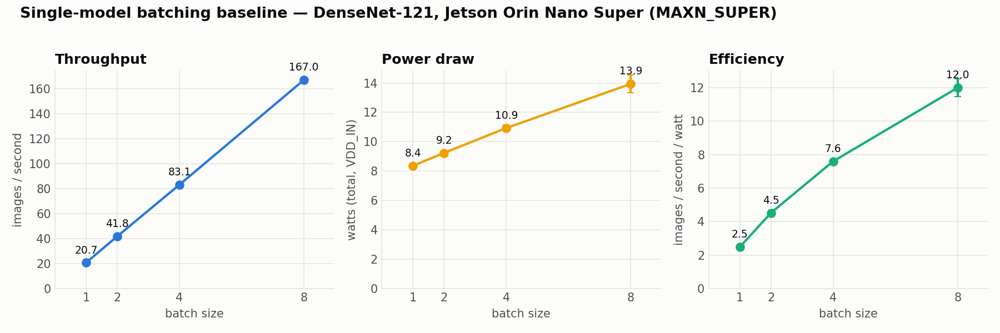

# XP1 — Single-model baselines (sequential vs batched)

The floor everything else is measured against: one DenseNet-121, images pushed
through **one at a time** vs **as a batch**.

## Result
| Config | Throughput | GPU |
|---|---:|---:|
| Sequential (batch 1) | 20.7 img/s | ~17% |
| Batch 2 | 41.8 img/s | ~26% |
| Batch 4 | 83.1 img/s | ~46% |
| Batch 8 | **167 img/s** | ~80% |

Throughput is **linear in batch size** with flat ~49 ms latency; efficiency rises
2.5 → 11.8 img/s/W. Batching is the efficiency king for a single model.



## Run (on the board)
```bash
~/xray-venv/bin/python benchmark.py --configs S1,B2,B4,B8 --repeats 3 --n-images 200
```

## Files
`benchmark.py` (orchestrator, writes results/raw/*.json) · `runner_sequential.py` ·
`runner_batched.py` · `smoke_test.py` (env check + one inference). Shared code in `lib/`.
