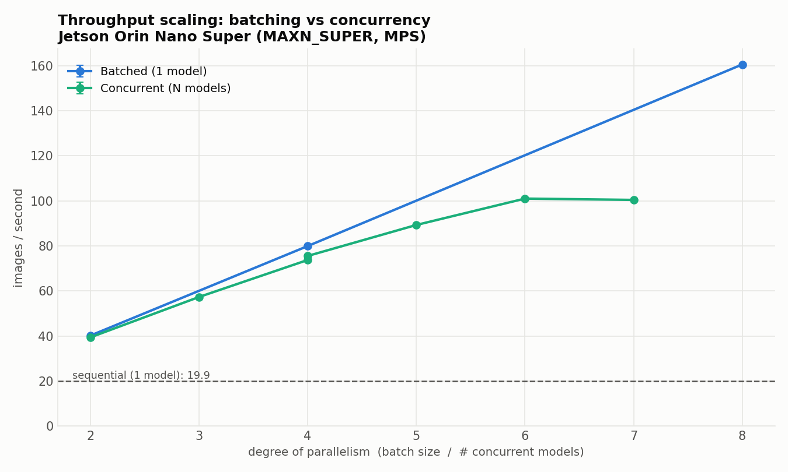
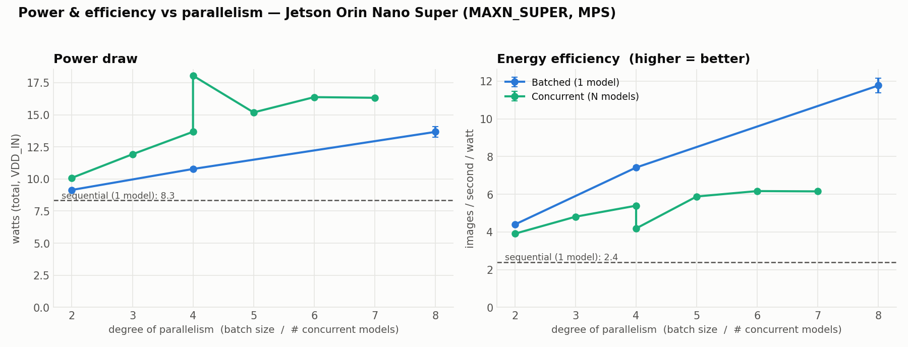

# XP2 — Concurrency (multiprocessing + CUDA MPS) & the memory wall

Run **N model instances at once**, one process each, under CUDA MPS, and measure how
throughput, latency, and power scale — the alternative to batching when you can't fuse
work into one forward pass.

> Scope note: these are N copies of the **same** model (DenseNet-121). We originally
> also ran a "different models" case using different-dataset DenseNet variants, but
> those aren't genuinely different models — same architecture, same 14 diseases — and
> they measured *identically* to same-model concurrency (the GPU does the same work),
> so they're dropped here. Genuinely different **architectures** are a separate thing
> (XP4). The systems behaviour below is model-agnostic.

## Result (mean over 3 runs, ±1 SE)
| N concurrent | 1 | 2 | 3 | 4 | 5 | 6 | 7 | 8 |
|---|---|---|---|---|---|---|---|---|
| img/s | 19.9 | 39.4 | 57.3 | 73.8 | 89.3 | **101.0** | 100.4 | ✗ |
| ±SE | 0.0 | 0.1 | 0.4 | 0.4 | 0.4 | 0.3 | 0.1 | — |
| latency ms | 50 | 50 | 53 | 54 | 56 | 60 | **71** | — |

- Real but **sublinear**; **saturates at N≈6** (~100 img/s, 5×). N=7 adds latency, no gain.
- **N=8 hits a memory wall** — 8 per-process CUDA contexts (~1 GB each) exceed the
  8 GB board and thrash. The ceiling is per-process *context* memory, not weights.
- **Concurrency loses to batching** (see below): at 4-way, batch-4 = 80 img/s @ 11 W,
  but 4 concurrent = 74 img/s @ 13.7 W. So you only reach for concurrency when the
  work genuinely *can't* be batched (different weights).




## Why concurrency draws more power than batching

Two effects. **(1)** Power rises with N because more of the GPU lights up — ~8 W at
17 % utilisation (sequential) up to ~16 W at ~78 % (six concurrent). **(2)** At the
*same* degree of parallelism, concurrency draws **more** power than batching for
*less* throughput, because:

- **Redundant weight traffic (the main reason):** batch-8 reads the DenseNet weights
  from DRAM **once** and applies them to all 8 images; 8 concurrent processes each have
  their own CUDA context and re-read the weights independently → **~N× the weight
  memory traffic.** DRAM access is power-hungry, so moving the same weights N times
  burns extra watts.
- **Lost kernel fusion + overhead:** batching runs one large efficient kernel;
  concurrency runs N separate kernel streams the scheduler interleaves, with N× the
  launch/scheduling overhead.

Batching amortises the weight read and fuses the math; concurrency replicates that work
N times — hence more watts for fewer images.

## Run
```bash
setsid bash run_concurrent.sh --repeats 3 --duration 8 --same 2,4,5 --ramp 3,6,7
```

## Files
`runner_concurrent.py` (process-per-model, barrier-timed window) ·
`benchmark_concurrent.py` (orchestrator, MPS control) · `probe_ramp.py` (ceiling probe) ·
`run_concurrent.sh` (detached launcher). Also drives XP3 and XP4.
