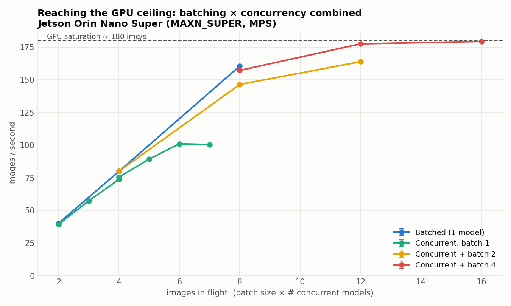
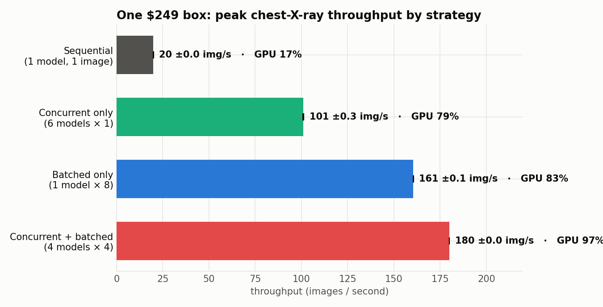

# XP3 — Concurrent + batched (reaching the GPU ceiling)

Combine both forms of parallelism: **N model copies, each running a batch of B**.
Neither alone saturates the GPU — together they do.

## Result (mean ± SE over 3 runs)
| Config | img/s | GPU |
|---|---:|---:|
| Concurrent only (6 × 1) | 101.0 ± 0.3 | 79 % |
| Batched only (1 × 8) | 160.5 ± 0.1 | 83 % |
| **Concurrent + batched (4 × 4)** | **179.3 ± 0.7** | **97 %** |

The batch-4 sweep in full: `C2b4` 157.2 ± 0.7 (89 %), `C3b4` 177.5 ± 0.5 (96 %),
`C4b4` 179.3 ± 0.7 (97 %); the batch-2 sweep: `C2b2` 80.0 ± 0.4, `C4b2` 146.4 ± 0.7,
`C6b2` 163.8 ± 0.4. Run-to-run variance is under 0.5 % (error bars in the figures are
therefore tiny — that *is* the reproducibility result).

**The device's real ceiling is ~180 img/s at 97 % GPU**, reached by combining batching
and concurrency — neither reaches it alone (batching plateaus ~160, pure concurrency
~100). The winning config is 4 model copies each batching 4 images.




## Run (uses XP2's orchestrator with --batch; 3 repeats)
```bash
setsid bash ../xp02_concurrency/run_concurrent.sh --repeats 3 --duration 8 \
    --same 2,3,4 --ramp , --batch 4
setsid bash ../xp02_concurrency/run_concurrent.sh --repeats 3 --duration 8 \
    --same 2,4,6 --ramp , --batch 2
```

## Files
No new code — uses `../xp02_concurrency/benchmark_concurrent.py --batch B`.
