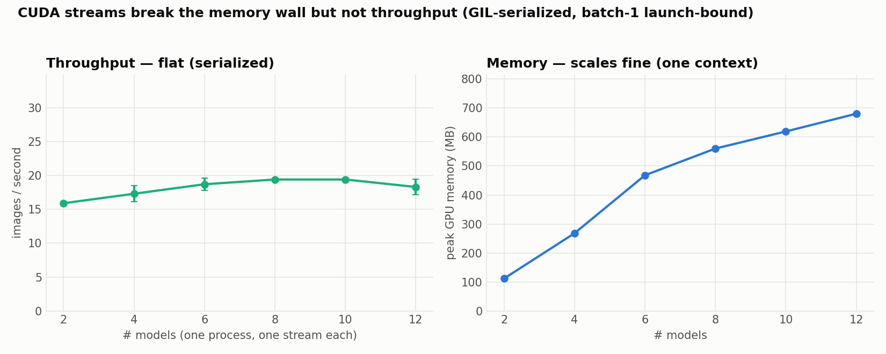

# XP5 — CUDA streams: memory vs throughput trade-off

XP2 got real concurrency by running each model in its **own process** (via CUDA MPS),
but that caps out ~6 models on memory. Can we pack *more* models cheaply by keeping them
all in **one process, one CUDA context, giving each its own CUDA stream**? A stream is an
ordered queue of GPU work, and in principle separate streams can overlap. Test result:
it fixes memory but **completely fails to add throughput**.

## Result (mean ± SE over 3 runs)
| N models | throughput | round latency | peak memory |
|---:|---:|---:|---:|
| 2 | 15.9 ± 0.1 img/s | 126 ms | 112 MB |
| 6 | 18.7 ± 0.9 img/s | 323 ms | 468 MB |
| 8 | 19.4 ± 0.1 img/s | 413 ms | 560 MB |
| **12** | **18.3 ± 1.2 img/s** | 661 ms | **680 MB** |



**12 models still only do 18 img/s** — the *same rate as a single model* (~20 img/s).
Adding models buys nothing but latency: each extra model just lengthens the round
(12 models → 661 ms per round) while throughput stays flat.

### Why isn't it faster?
Even though each model has its own stream, the streams don't actually overlap here:
- **Python's GIL serializes the launches** — one model's kernels are all issued before
  the next model's begin, so the GPU sees one model's work at a time.
- **The models are batch-1 and launch-bound** — each kernel is tiny and the GPU is
  mostly idle *waiting for the next launch*, so there's no spare compute for a second
  stream to fill even if the launches did interleave. (This is the same launch-bound
  regime XP4 diagnosed — 18 % GPU utilisation.)

So "many models, one stream each, one process" runs **effectively serial**: throughput
is pinned at 1× a single model no matter how many you add.

### Streams vs. concurrent processes — the head-to-head
This is the whole point. Same GPU, same model, same N — the *only* difference is how the
models are hosted:

| N models | XP5 streams (1 process) | XP2 concurrent (N processes, MPS) | speedup |
|---:|---:|---:|---:|
| 2 | 15.9 img/s | 39.4 img/s | 2.5× |
| 6 | 18.7 img/s | **101.0 img/s** | **5.4×** |

Separate processes let the kernel launches *actually* run in parallel (each process has
its own GIL, and MPS lets them share the GPU concurrently), so throughput scales ~5× to
the saturation point. Cramming everything into one process with per-model streams does
not.

**Conclusion: packing many models into one stream/one process is not a good idea for
throughput** — it serializes on the GIL and gives you a single model's rate. Use it only
when you're *memory*-bound and don't need speed. For throughput you want either **separate
concurrent processes** (XP2, memory-capped ~6) or **TensorRT** (XP6), whose compiled
engines genuinely overlap *in-process* (252→460 img/s across streams) because there's no
Python in the launch path.

## Run
```bash
setsid bash run_streams.sh 2 4 6 8 10 12
```

## Files
`runner_streams.py` · `run_streams.sh`.
