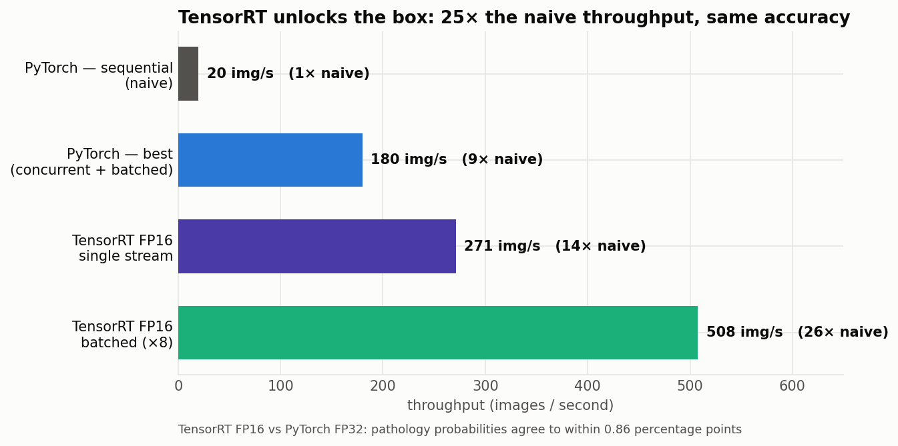

# XP6 — TensorRT FP16

Port the DenseNet to a **TensorRT FP16 engine** (layer fusion + kernel auto-tuning
for this exact chip — *not* INT8, so accuracy is preserved).

## Result
Throughput = mean ± SE over 3 spaced runs.

| Stage | Throughput | vs naive |
|---|---:|---:|
| PyTorch sequential | 19.9 img/s | 1× |
| PyTorch best (concurrent+batched) | 180 img/s | 9× |
| TensorRT FP16, single stream | 271.1 ± 0.4 img/s | 14× |
| **TensorRT FP16, batched ×8** | **507.7 ± 0.6 img/s** | **26×** |

- **Accuracy preserved:** FP16 vs PyTorch FP32 pathology probabilities agree to
  within **0.86 pp**; re-verified macro-AUROC on 2000 labeled ChestMNIST images is
  **0.7405 ± 0.0134** (1000-sample bootstrap SE) — identical to PyTorch FP32. See
  `trt_eval_auroc.py`.
- **TRT engines overlap in-process** (252→460 img/s, K=1..8) where CUDA streams did
  not, with no memory wall — one execute call per model, not 200 GIL-serialized kernels.



## Run
```bash
~/xray-venv/bin/python trt_export.py densenet121-res224-all ~/densenet_all.onnx --batch 1
/usr/src/tensorrt/bin/trtexec --onnx=~/densenet_all.onnx --fp16 --saveEngine=~/densenet_all.engine \
    --minShapes=image:1x1x224x224 --optShapes=image:4x1x224x224 --maxShapes=image:8x1x224x224
~/xray-venv/bin/python ../../lib/trt_runner.py ~/densenet_all.engine   # accuracy + concurrent test
```

## Files
`trt_export.py` (→ ONNX) · `trt_eval_auroc.py` (AUROC on labeled data). Runtime
`lib/trt_runner.py`. Data `../../results/trt_bench.json`.
