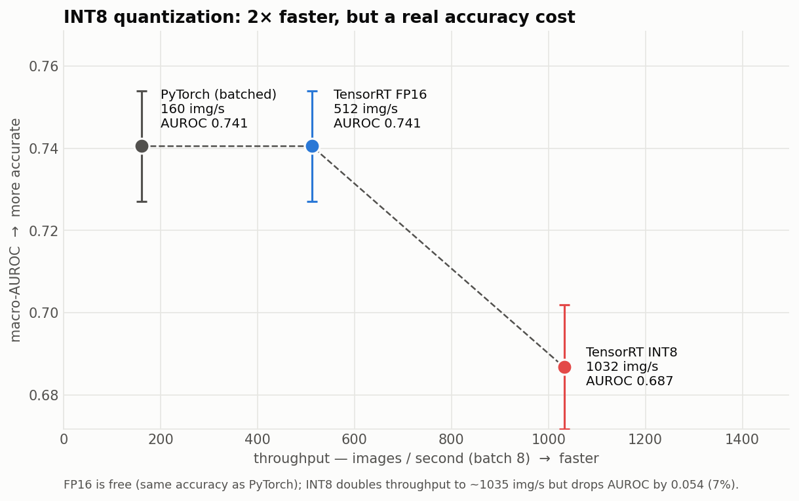

# XP7 — INT8 quantization (speed vs accuracy)

Unlike FP16, INT8 *can* move predictions — so we calibrate on real images and
measure the real AUROC cost.

## Result
Throughput = mean ± SE over 3 spaced runs; AUROC ± 1000-sample bootstrap SE.

| Precision | Throughput (batch 8) | AUROC | Engine |
|---|---:|---:|---:|
| TensorRT FP16 | 511.9 ± 0.6 img/s | **0.7405 ± 0.0134** (= PyTorch) | 14.9 MB |
| TensorRT INT8 | **1032.2 ± 1.5 img/s** (2×, 52× naive) | 0.6868 ± 0.0151 (**−0.054**) | 8.8 MB |

INT8 doubles throughput but costs **0.054 AUROC (7%)**. FP16 remains the safe default.
(QAT / per-channel INT8 could narrow the gap.)
AUROC re-verified on 2000 labeled ChestMNIST images; the point-estimate drop (0.054)
is ~3.6× the per-estimate SE, though a paired test would give tighter significance.

> **Why this FP16 says 512 img/s but [XP6](../xp06_tensorrt_fp16/) says 508:** they're
> two different spaced runs. This 511.9 is FP16 re-measured on the **same `densenet-nih`
> engine used for INT8 calibration**, so it's the exact apples-to-apples baseline for the
> INT8 comparison here. XP6's headline 507.7 is the FP16 sweep on the `densenet-…-all`
> variant. The ~0.8 % gap is run-to-run variance + model variant, not a real difference.



## Run
```bash
~/xray-venv/bin/python trt_int8.py ~/densenet_nih.onnx ~/densenet_nih_int8.engine
~/xray-venv/bin/python ../xp06_tensorrt_fp16/trt_eval_auroc.py ~/densenet_nih_int8.engine
```

## Files
`trt_int8.py` (calibrated INT8 build, torch-tensor calib buffer). Eval via XP6's
`trt_eval_auroc.py`. Data `../../results/trt_bench.json` (`int8` block).
