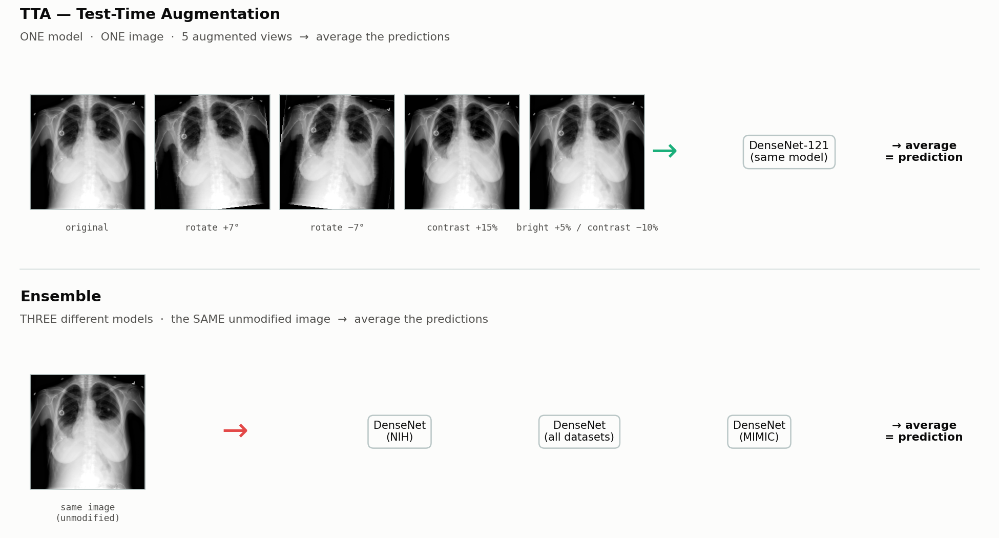
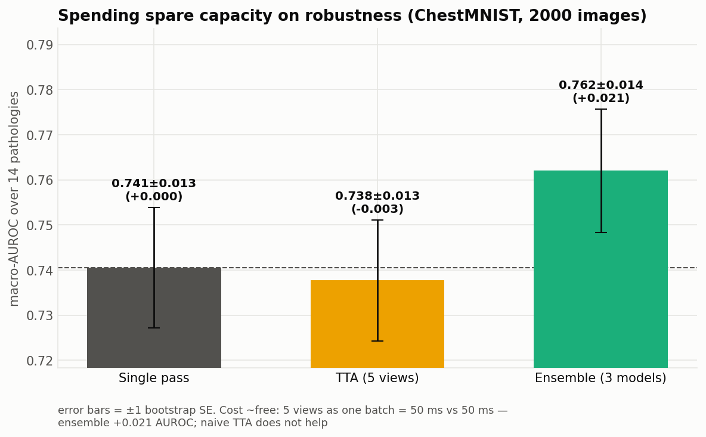
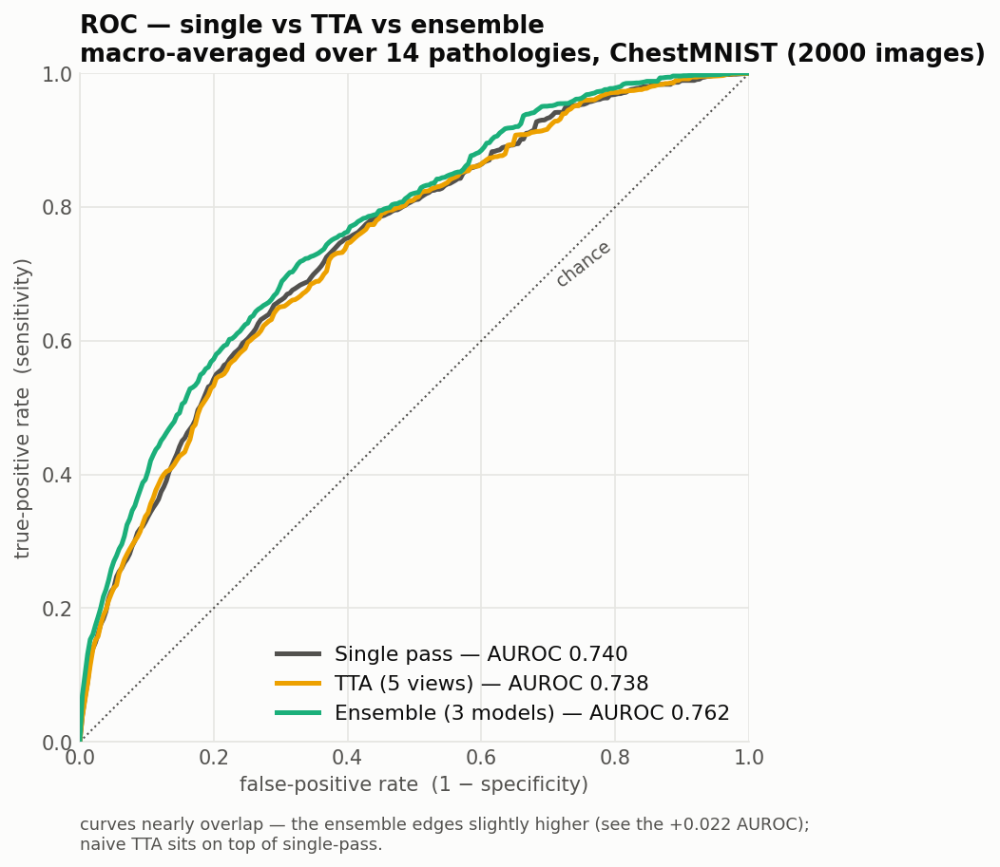

# XP8 — TTA / ensemble robustness

Spend the spare GPU capacity on *reliability* instead of speed. Evaluated on
**ChestMNIST-224** (NIH, 2000 labeled test images, auto-downloaded — no Kaggle),
macro-AUROC over 14 pathologies.

## What are TTA and Ensemble?

Two different ways to average away individual-prediction errors — they vary *different*
things:

- **TTA (Test-Time Augmentation):** **one model**, and **the same image shown in several
  mildly-augmented views** (small rotations, contrast/brightness shifts). The model
  classifies each view, and the predictions are averaged. Idea: averaging over
  slightly-different *valid* views cancels single-pass noise. *(It varies the **image**.)*
- **Ensemble:** the **same, unmodified image** fed to **several different models** (here,
  DenseNet-121s trained on different datasets — NIH, all, MIMIC). Their predictions are
  averaged. Idea: models trained differently make different mistakes, which cancel.
  *(It varies the **model**.)*

The picture below is generated from a real ChestMNIST image (`illustrate.py`) — the top
row is literally the same X-ray in 5 augmented views (one model); the bottom is one
image through three models:



## Result
| Method | AUROC (± bootstrap SE) | Δ |
|---|---:|---:|
| Single pass | 0.7405 ± 0.0134 | — |
| TTA (5 augmented views) | 0.7377 ± 0.0134 | −0.003 |
| **Ensemble (3 different-dataset DenseNets)** | **0.7620 ± 0.0137** | **+0.022** |

- **Ensembling helps** (+0.022) — but with proper error bars (±1 bootstrap SE) the
  per-estimate CIs overlap, so at 2000 images the gain is **suggestive, not
  conclusive**; a paired test or more data would firm it up. Honest, not overclaimed.
- **Naive TTA does not help** (−0.003, squarely within noise) — matches the literature.
- **Cost ~free:** 5 views / 3 models run as one batch cost ~the same as a single pass —
  the spare capacity absorbs it.

### Which augmentations, and does *more* of them help?

The 5 views are all **label-preserving** variations a real chest X-ray genuinely shows
shot-to-shot (see `_augment` in `tta_experiment.py`):

| Transform | Why it's valid on a CXR |
|---|---|
| **brightness / contrast** | exposure (kVp/mAs) varies every shot — **the most realistic** knob |
| **mild rotation ±6°** | patients aren't perfectly upright; slight positioning tilt |
| **mild scale ±6%** | source-to-detector distance / crop zoom varies |

We deliberately **do not horizontal-flip** — that would swap left/right and flip
cardiac/situs laterality, so it is *not* label-preserving (the heart is on the left).

Does throwing more views at it help? We ran it at **5 and at 10** views (the 10-view bank
adds two zooms and four combined rotate+exposure+zoom views):

| Config | AUROC | Δ vs single | Latency (1 batch) |
|---|---:|---:|---:|
| Single pass | 0.7405 | — | 49.5 ms |
| TTA — 5 views | 0.7377 | −0.0028 | 49.6 ms (**1.00×**) |
| TTA — 10 views | 0.7376 | −0.0029 | 51.4 ms (1.06×) |

Doubling the views moves AUROC by **0.0001** — i.e. nothing. The lesson isn't "use fewer
views," it's that **naive averaging of augmented views doesn't add signal here regardless
of count**; the diversity that *does* help comes from **different models** (the ensemble),
not different views of the same model. More views only cost more compute for no gain.



### ROC curves

Macro-averaged ROC over the 14 pathologies (the threshold-free view behind the AUROC).
The three curves nearly overlap — **the ensemble (green) edges slightly higher, while
TTA (yellow) sits right on top of single-pass** — which is exactly the honest picture:
a small real ensemble gain, no TTA gain. (ChestMNIST is multi-label, so this is the
right visual — a standard multi-class confusion matrix doesn't apply, and would need
an arbitrary threshold; ROC/AUROC is threshold-free.)



> **Note (double-sigmoid fix):** the eval path here originally applied `torch.sigmoid` to
> outputs that torchxrayvision already sigmoids internally, squashing the saved
> probabilities into [0.5, 0.73]. Since AUROC/ROC are rank-based and sigmoid is monotonic,
> **every number and curve above is unchanged** — verified by re-running with the fix. It
> only mattered for the *probability values*, which is how [XP14](../xp14_calibration/)
> caught it. Now fixed; the committed predictions are the real values.

## Run
```bash
setsid bash run_tta.sh --n 2000 --views 5
```

## Files
`tta_experiment.py` · `run_tta.sh`. Label map + AUROC in `lib/chest_labels.py`.
Data `../../results/tta_bench.json`.
