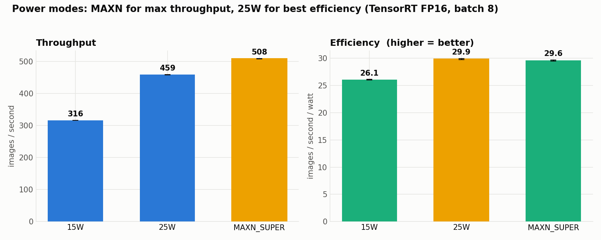

# XP9 — Power-envelope sweep

Same TensorRT FP16 batch-8 workload run at each of the board's power modes, to find the
throughput / power / efficiency trade-off.

## What is a "power mode"?

A Jetson doesn't run at one fixed speed — you pick a **power budget** (a cap on how many
watts the whole module may draw), and the board configures itself to stay under it. On
this Orin Nano Super the tool is `nvpmodel`, and it ships three presets:

| `nvpmodel` | Budget | What it does under the hood |
|---|---|---|
| mode 0 | **15 W** | fewest CPU cores online, lowest CPU/GPU/RAM clock ceilings |
| mode 1 | **25 W** | more cores, higher clock ceilings |
| mode 2 | **MAXN_SUPER** | uncapped — every core online, clocks free to hit their max |

A mode enforces its budget by three knobs: **how many CPU cores are online**, the
**maximum clock frequency** allowed for the CPU / GPU / memory controller, and the
resulting voltage. A tighter budget = lower clocks = fewer operations per second, but
also less power and less heat. (`jetson_clocks`, which we assert everywhere, is separate:
it *pins* clocks to the ceiling of whatever mode you're in, removing the on-demand
governor's ramp-up lag — it does not change the budget itself.)

## Why does this matter?

On a datacenter GPU you don't think about watts. At the **edge**, power *is* the design
constraint, for three reasons:

- **Heat.** A fanless or small-fan clinic box can only dissipate so many watts before it
  **thermal-throttles** (the chip force-lowers its own clocks to avoid overheating) — at
  which point your "peak" throughput silently collapses. Running cooler avoids that.
- **Battery / power supply.** A cart-mounted or portable unit runs off a battery or a
  thin supply; every watt is runtime and cost.
- **Efficiency ≠ speed.** More power does *not* buy proportionally more throughput —
  clocks hit diminishing returns. The metric that matters for a 24/7 deployment is
  **images per second per watt**, and its best point is usually *not* the fastest mode.

That's exactly what this sweep measures: not just "how fast," but "how fast **per watt**,"
so you can choose the right operating point for a given box instead of always maxing out.

## Result
Mean ± SE over 3 runs per mode.

| Mode | Throughput | Power | Efficiency |
|---|---:|---:|---:|
| MAXN_SUPER | 508.5 ± 0.6 img/s | 17.2 W | 29.58 ± 0.12 img/s/W |
| **25 W** | 459.0 ± 0.6 img/s | 15.4 W | **29.86 ± 0.09 img/s/W** |
| 15 W | 316.3 ± 0.0 img/s | 12.1 W | 26.07 ± 0.05 img/s/W |

**MAXN for peak throughput; 25 W for best efficiency** (≈90% of the throughput,
1.8 W less). 15 W throttles too hard. For a battery/fanless clinic box, 25 W is the
operating point.



## Run
```bash
~/xray-venv/bin/python power_sweep.py ~/densenet_nih_fp16.engine
```

## Files
`power_sweep.py` (sets nvpmodel, restores MAXN_SUPER after). Data
`../../results/power_sweep.json`.
