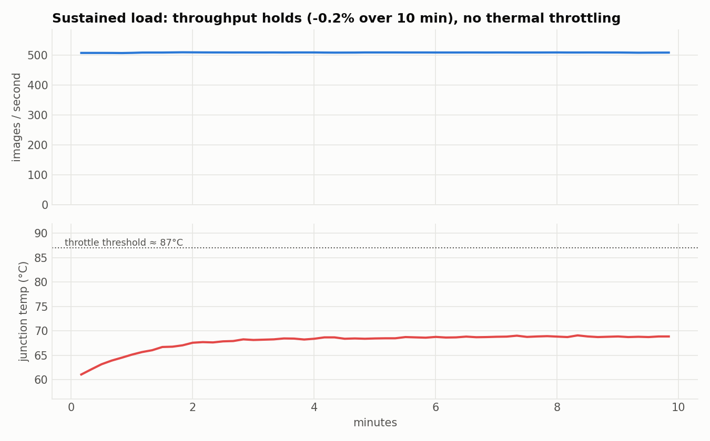

# XP10 — Sustained-load thermal endurance

20 minutes of continuous TensorRT FP16 inference — does it throttle?

## Result
- **Throughput: 507 → 508 img/s (−0.2%)** — dead flat (re-verified in a second run).
- **Temp plateaus at ~69–71 °C** (from 58 °C), well under the ~87 °C throttle threshold.
  Steady 18 W, GPU 98%.
- **No thermal throttling** — the box sustains full throughput indefinitely. A real
  always-on device, not a benchmark burst. (Transient throttling only appears from
  many back-to-back heavy runs with no cooldown, not from a single sustained load.)



## Run
```bash
~/xray-venv/bin/python endurance.py ~/densenet_nih_fp16.engine --minutes 20
```

## Files
`endurance.py`. Data `../../results/endurance.json`.
