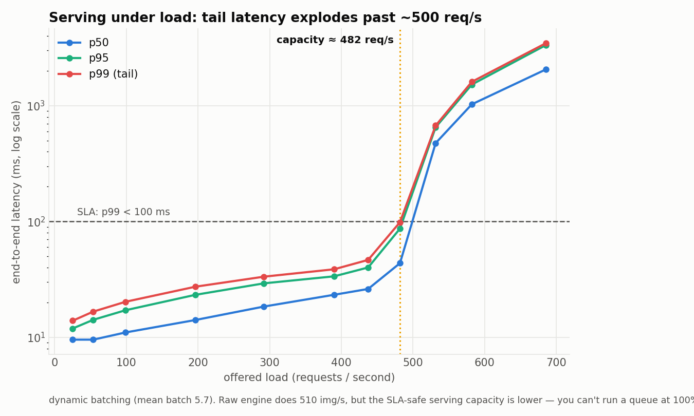

# XP11 — Dynamic-batching serving layer + latency under load

A throughput number (XP6: 510 img/s) tells you the engine's peak. A *server* has to
hold a **latency SLA** while requests arrive at unpredictable times — so this turns
the engine into a real serving layer and measures what it can actually deliver.

**The server** (`serving.py`): each model has a request queue and a worker thread
that owns its TensorRT context + CUDA stream. The worker forms a batch when it has
`max_batch` requests **or** `max_delay_ms` has elapsed (dynamic batching), runs the
engine, and completes the whole batch together. **The load generator** (`loadgen.py`):
open-loop Poisson arrivals at a target rate (fire-and-forget, so slow responses don't
throttle new arrivals), sweeping RPS and measuring end-to-end latency (queue + batch
formation + inference).

## Result — the queueing hockey stick

DenseNet-121 FP16, `max_batch=8`, `max_delay=5 ms`, SLA = p99 < 100 ms.

| Offered RPS | p50 | p95 | p99 | SLA |
|---:|---:|---:|---:|:--:|
| 100 | 11 ms | 17 ms | 20 ms | ✅ |
| 300 | 19 ms | 29 ms | 33 ms | ✅ |
| 450 | 26 ms | 40 ms | 47 ms | ✅ |
| **500** | 44 ms | 87 ms | **99 ms** | ✅ (the knee) |
| 550 | 475 ms | 651 ms | 673 ms | ❌ |
| 700 | 2055 ms | 3332 ms | 3458 ms | ❌ |



**The lesson a throughput number hides:** raw engine throughput is **510 img/s**, but
the **SLA-safe serving capacity is ~482 req/s** — you *cannot* run a queue at 100%
utilisation, because the tail latency explodes the moment arrivals exceed service
rate (classic M/M/1 behaviour). Dynamic batching adapts automatically — mean batch
size rises from ~1 at light load to 8 at saturation (measured mean 5.7).

## Run
```bash
~/xray-venv/bin/python loadgen.py --rps 25,50,100,200,300,400,450,500,550,600,700 \
    --duration 8 --sla-p99-ms 100
```

## Files
`serving.py` (DynamicBatcher + Server) · `loadgen.py` (open-loop Poisson load).
Runtime `lib/trt_runner.py`. Data `../../results/serving_bench.json`.

## Next (XP12)
This server is the substrate for the **energy-adaptive governor**: a control loop
that scales the board's power envelope (15 W ↔ 25 W ↔ MAXN) to the live load to
minimise Joules/image while holding this SLA.
