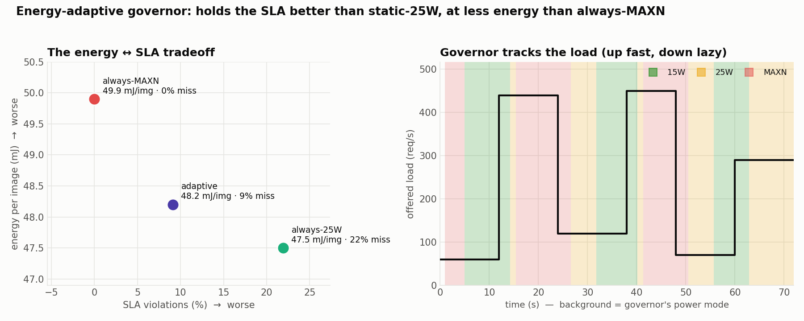

# XP12 — Energy accounting + load-adaptive power governor

## The idea in one line

A clinic day isn't busy all the time — quiet stretches, then bursts during rounds. XP9
showed the board has power modes (15 W / 25 W / MAXN). **So: can we save energy by
automatically turning the power *down* when it's quiet and back *up* when a burst hits —
without breaking the latency SLA from XP11?** We build that auto-scaler ("governor") and
measure whether it actually helps. The honest answer: **a little, but less than you'd
hope — and this experiment is about being clear-eyed about why.**

## Power vs energy (the distinction the whole experiment turns on)

- **Power** = watts (W) = the *rate* you burn electricity *right now*.
- **Energy** = joules (J) = power × time = the *total* you burned to get a job done.
  We report **energy per image (mJ/img)** — the total joules the board drew over the run,
  divided by how many X-rays it served. **Lower = cheaper to run.** This, not peak watts,
  is what shows up on the electricity bill and drains a battery.

A faster mode uses more watts but finishes sooner, so energy/image is what tells you if a
power mode is actually *cheaper* — not the wattage on the label.

## The three policies we compare

Replaying the same bursty clinic-day load profile (quiet ↔ rounds ↔ peaks of ~440 req/s):

- **always-MAXN** — never throttle. Safest for latency, presumably most energy.
- **always-25 W** — permanently capped at 25 W. Presumably saves energy, but can it keep up
  during bursts?
- **adaptive (the governor)** — measure the request rate each second; **scale up instantly**
  when load rises (defend the SLA), **scale down lazily** (wait 5 s, hysteresis) so it
  doesn't flap. Thresholds come from the measured SLA-safe capacities: 15 W≈300, 25 W≈460,
  MAXN≈510 req/s.

**Why no "always-15 W" policy?** Two reasons make it a non-starter as a static baseline:
1. **It can't serve the load.** 15 W's SLA-safe capacity is only ~300 req/s, but the
   clinic profile has sustained segments at **440, 450, and 290 req/s**. So always-15 W
   would blow the SLA on essentially every non-quiet segment — a catastrophic violation
   rate, far worse than 25 W's 22 %. It's not a trade-off point, it's a broken one.
2. **It wouldn't even save energy.** 15 W is the *least* energy-efficient mode per image
   (XP9: 26 vs 30 img/s/W), so it's **dominated on both axes** — worse SLA *and* worse
   energy than 25 W. A point that loses on every dimension adds nothing to the plot.

15 W *is* still in the experiment, though — the **adaptive governor drops to 15 W during
the quiet stretches** (the green bands in the figure's right panel). We use it where it
fits (idle periods), just not as an always-on policy where it's guaranteed to fail.

## Result

| Policy | Energy/img | Avg power | p99 latency | SLA violations |
|---|---:|---:|---:|---:|
| always-MAXN | 49.9 mJ | 11.5 W | 55 ms | **0.0 %** |
| always-25 W | 47.5 mJ (**−4.7 %**) | 10.9 W | 334 ms | **21.9 %** |
| **adaptive** | 48.2 mJ (**−3.4 %**) | 11.1 W | 202 ms | 9.1 % |



## How to read the table

Read across, comparing each policy to **always-MAXN** as the baseline:

- **always-25 W** saves **4.7 % energy** — but look at the last column: it **misses the SLA
  21.9 % of the time**. During bursts, a 25 W cap can't clear the queue fast enough, so p99
  latency blows up to 334 ms (the queueing explosion from XP11). Cheap, but it breaks its
  promise one request in five.
- **always-MAXN** never misses (0 %) but spends the most energy.
- **adaptive** lands *between* them: **−3.4 % energy** and only **9.1 %** misses — better SLA
  than static-25 W, less energy than always-MAXN. It's a real, sensible middle point.

**What exactly is a "miss"?** A miss = **one X-ray whose answer came back slower than the
100 ms target**. Concretely the code measures `mean(latency > 100 ms)` over every request,
so "22 % SLA violations" means *22 % of the individual requests took longer than 100 ms to
be answered*. The request isn't dropped or lost — it's still served, just too slowly to
count as on-time. (It's a **latency** miss, not a lost request.)

### How to read the two panels

**Left panel — the trade-off.** Energy per image on the y-axis (down = cheaper), SLA misses
on the x-axis (left = better). The three points form a **trade-off frontier**: you buy lower
energy with worse SLA. always-MAXN is top-left (0 % miss, most energy); always-25 W is
bottom-right (cheapest, but 22 % miss); the governor sits in between — a genuinely good
compromise point.

**Right panel — the governor working over time.** The **black line is the offered load**
(req/s) as the clinic day plays out: quiet (~60) → burst (440) → lull (120) → burst (450) →
quiet (70) → medium (290). The **background colour is the power mode the governor chose** at
that moment — **green = 15 W, yellow = 25 W, red = MAXN** (see legend). Read them together:
- when the black line is **low**, the background is **green** (15 W) — saving power while
  quiet;
- the instant the line **jumps to a burst**, the background turns **red** (MAXN) about
  1–2 s later — that small delay is the **"up fast"** reaction (and the ~9 % misses happen
  in that catch-up window);
- when the line **drops**, the background stays red/yellow for a few seconds before going
  green again — that's the **"down lazy"** dwell (hysteresis), so it doesn't flap on every
  wiggle.

## The honest bottom line (why this is a "meh, but instructive" result)

The governor does what it's designed to do — but notice the **entire energy axis only spans
~5 %** (47.5 → 49.9 mJ). Turning the power cap up and down is a **weak lever**, for reasons
worth understanding:

1. **At low load, all modes draw about the same power** (~11 W average). The GPU does the
   small amount of work and then **races to idle** — the cap only bites when the GPU is
   *sustained* busy, which is a minority of the clinic day. So most of the time, the mode
   you picked barely matters.
2. **15 W is actually the *least* energy-efficient mode per image** (XP9: 26 vs 30 img/s/W).
   A lower power *cap* does **not** mean lower energy *per image* — it just runs slower. The
   low modes are for peak-power / thermal limits, not for saving energy.
3. **The real energy lever is utilisation, not power mode.** Keep the GPU busy (batching,
   XP6) and you get ~30 img/s/W *regardless of mode*. Power-mode scaling is a few-percent
   trim on top of that, not the main event.
4. **Reacting has lag.** The governor takes ~1–2 s to notice a burst and escalate, so it
   can't quite match MAXN's 0 % (a predictive or shorter-dwell policy would close some of
   the 9 %).

**So what would you actually deploy?** For a strictly latency-critical service, just run
MAXN — the ~3 % energy saving isn't worth *any* SLA risk. The governor earns its keep only
when energy or thermal budget genuinely matters more than the last few percent of tail
latency (a battery cart, a fanless enclosure). Saying that plainly — instead of dressing a
3 % trim up as a breakthrough — is the point of the experiment.

## Run
```bash
~/xray-venv/bin/python governor_eval.py     # runs all three policies, restores MAXN
```

## Files
`governor.py` (adaptive controller + `set_mode`) · `governor_eval.py` (3-policy eval).
Energy integration in `lib/power_logger.py` (`energy_joules`). Builds on XP11's
`serving.py`. Data `../../results/governor_bench.json`.
