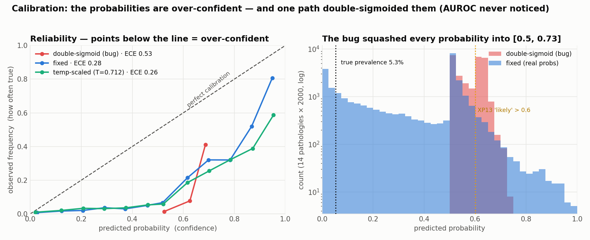

# XP14 — Calibration: do the probabilities mean what they say?

Every accuracy number so far is **AUROC**, which measures only **discrimination** — can the
model rank a sick patient above a healthy one? It says *nothing* about whether a predicted
"0.7" really means a 70% chance. That second property is **calibration**, and it's what
makes a probability safe to turn into a word like "likely" (exactly what XP13 does).

A model can have a fine AUROC and useless probabilities. So we measured calibration on the
DenseNet-nih single-model predictions over 2000 labeled ChestMNIST images (all 14
pathologies pooled) — and it immediately surfaced a bug.

## Finding 1 — a double-sigmoid bug that AUROC hid

torchxrayvision's model `forward` **already returns probabilities** (it applies
`sigmoid` + `op_norm` internally, because `op_threshs` is set on the pretrained weights).
The XP8 evaluation path called `torch.sigmoid()` on that output **again** — a second
sigmoid — squashing every "probability" into **[0.5, 0.73]** (`sigmoid(0)=0.5`,
`sigmoid(1)=0.73`).

Because a sigmoid is **monotonic**, it doesn't change the *ranking*, so **AUROC never
noticed** — every AUROC in the repo is exactly the same with or without the bug (verified:
single 0.7405, TTA 0.7377, ensemble 0.7620 are unchanged after the fix). That's precisely
why you need calibration analysis: it catches errors that discrimination metrics are blind
to. Fixed in `tta_experiment.py`; the committed predictions are now the real values.

## Finding 2 — even fixed, the probabilities are over-confident

| Version | Mean predicted | ECE ↓ | Brier ↓ |
|---|---:|---:|---:|
| double-sigmoid (bug) | 0.581 | 0.528 | 0.327 |
| **fixed** (real model probs) | 0.332 | **0.279** | 0.158 |
| temperature-scaled (T = 0.71) | 0.318 | 0.265 | 0.157 |

*ECE = Expected Calibration Error (average gap between confidence and reality; 0 = perfect).
True prevalence is only **5.3%**.*

- **Fixing the bug roughly halves ECE** (0.53 → 0.28) — the single biggest calibration win
  is just not double-sigmoiding.
- **But 0.28 is still badly miscalibrated.** The model's mean prediction is **0.33 when
  only 5.3% of cases are truly positive** — it is systematically **over-confident**. On the
  reliability diagram every curve sits *below* the diagonal (predicted > actual).
- **Temperature scaling barely helps** (0.28 → 0.26). That's itself informative: the
  miscalibration is **structural, not a simple confidence scale**. torchxrayvision's
  `op_norm` deliberately centers each pathology's *operating threshold* at 0.5 — so these
  are operating-point-normalized **scores**, not prevalence-calibrated probabilities. A
  proper fix is **per-class recalibration** (Platt / isotonic) against a held-out split —
  future work.



**How to read the figure.** *Left* — the reliability diagram: x = what the model predicted,
y = how often that was actually true; the dashed diagonal is perfect calibration, and every
curve below it means over-confidence (the red bug curve is both squashed into [0.5, 0.73]
*and* far below the line). *Right* — the predicted-probability distributions: the fix (blue)
spreads across [0,1], while the bug (red) is jammed into [0.5, 0.73]; the dotted lines mark
the true 5.3% prevalence and XP13's "likely > 0.6" wording threshold.

## Why this matters for XP13

XP13 turns probabilities into words with fixed thresholds (`> 0.6` = "likely"). This study
says: treat those as **relative confidence bands around the operating point, not literal
probabilities** — a "0.6" here does *not* mean a 60% chance. (XP13's report path is
separate and correctly single-sigmoided, so its numbers are properly ranged; the calibration
caveat is about interpreting any of these scores as true probabilities.)

## Run
```bash
python calibration.py        # pure numpy/scipy; reads results/tta_preds.npz, no board
```

## Files
`calibration.py` (ECE / Brier / reliability + temperature scaling). Reads
`results/tta_preds.npz`; writes `results/calibration.json`. Figure `fig_calibration` in
`analysis/make_figures.py`.
