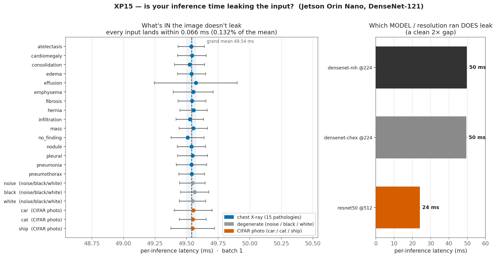

# XP15 — Is your inference time leaking the input?

An offline edge model still emits one thing an attacker can measure without seeing the
image: **how long each inference takes**. Timing side-channels are a real discipline
(SPA/DPA, constant-time crypto). So: does the time to classify a chest X-ray tell you
anything about the X-ray?

Measured on the Jetson, one image at a time (batch 1), with DPA-grade hygiene — locked
clocks, warm-up discarded, and an **interleaved schedule** so thermal drift can't fake a
per-category leak. We report **effect size**, not just a p-value.



## Result

**Content does not leak.** All 15 pathology categories, three degenerate inputs
(noise/black/white), **and three classes of real CIFAR photos (car, cat, ship)** land at
**49.54 ms** — a total spread of **0.066 ms, 0.13 % of the mean**. A cardiomegaly X-ray and
a **photo of a car** differ by **11 microseconds**. Energy is flat too (~404 mJ/inference,
~1 % spread). A dense CNN does the same arithmetic for every input of a given size, so it is
**constant-time in the content by construction** — nothing in the picture reaches the clock.

*(Kruskal-Wallis reports p ≈ 10⁻¹⁷ — the large-N p-value trap. An 11-µs gap is far below the
millisecond jitter of any real timing channel: effect size, not significance, is what an
attacker can use.)*

**Model / resolution does leak.** DenseNet@224 = 50 ms vs ResNet@512 = 24 ms — a clean 2×
gap. The two DenseNet weight sets are identical, so what shows is the **architecture and
input size**, never the content.

## Security takeaway

- **Per-image content is not a timing side-channel here** — no constant-time work is needed
  to hide the *image*; the CNN already is.
- **Model identity and input shape are** — if you multiplex models or accept variable
  resolutions behind one endpoint, the timing reveals *which pipeline ran*.
- The defense is **padding every request to a worst-case latency** across the
  models/resolutions you serve. It costs throughput, so it's a **premium high-assurance
  tier**, not the default.

*Blog: "Your model's inference time is leaking — just not the way you think."*

## Run

```bash
sudo jetson_clocks
~/xray-venv/bin/python experiments/xp15_timing_sidechannel/timing_leak.py --per-cat 100 --repeats 10
~/xray-venv/bin/python experiments/xp15_timing_sidechannel/make_figure.py
```
